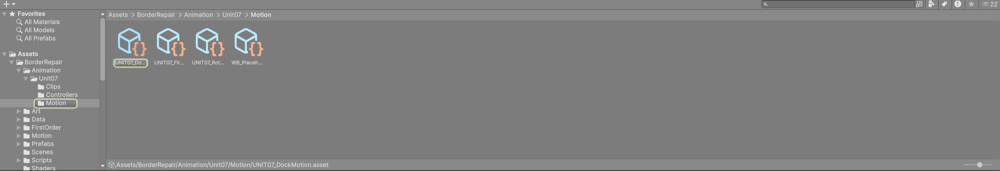
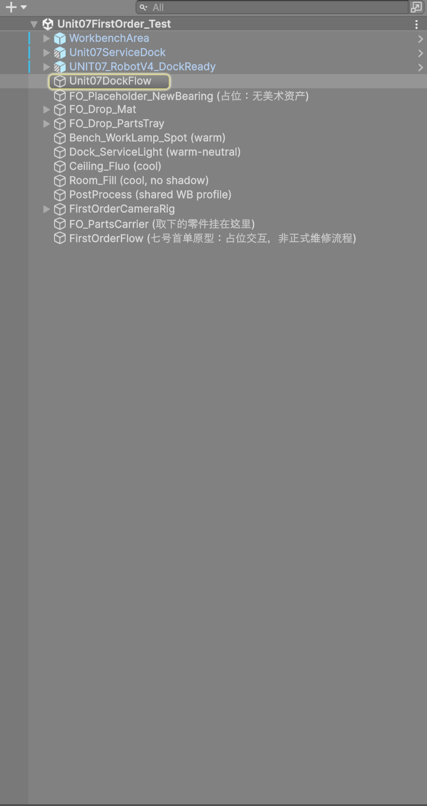
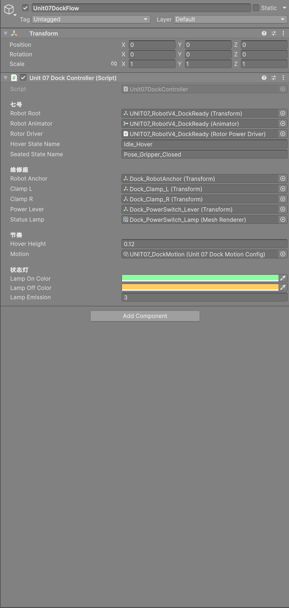
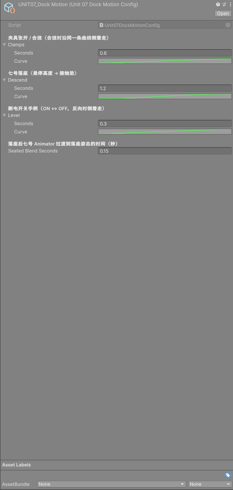
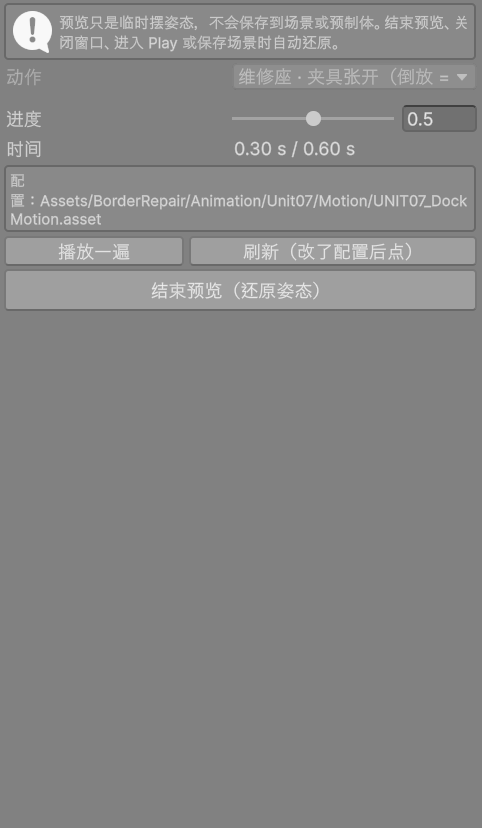
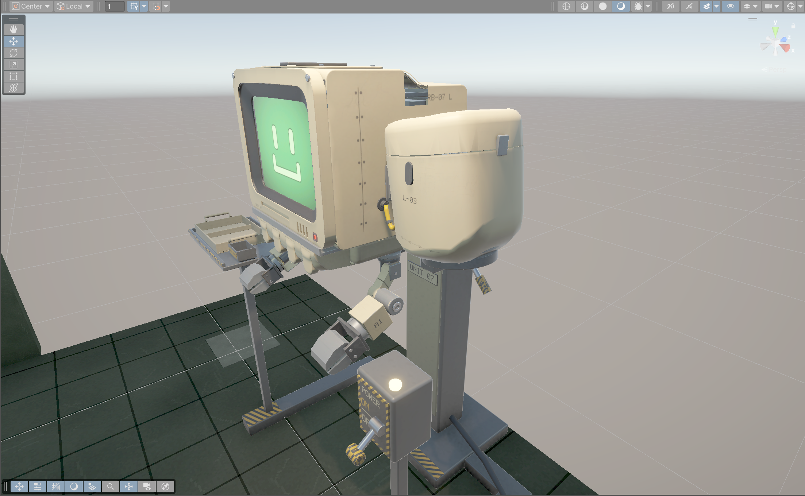
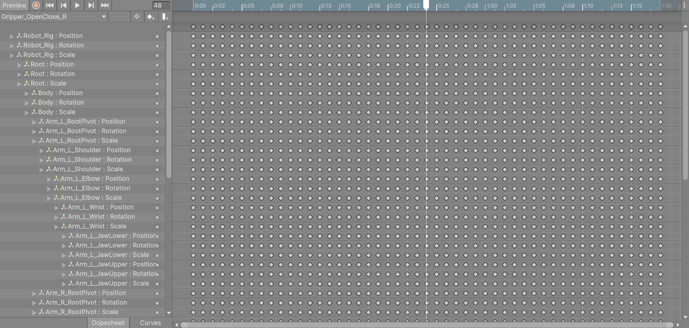
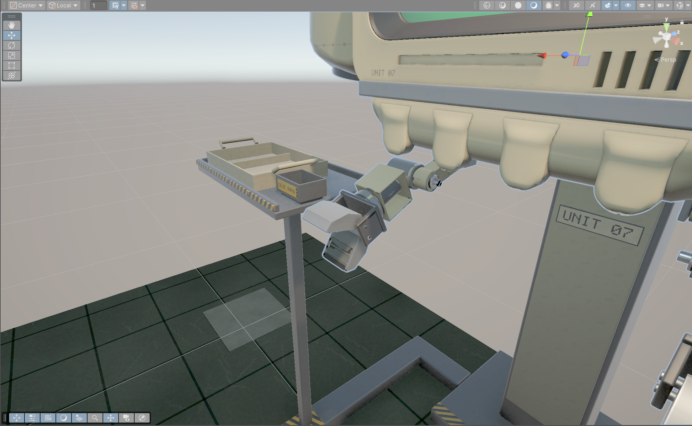

# 在 Unity 里手动改 UNIT 07 的动作（图文说明）

适合不写代码的同事。照着做，就能在 Unity 编辑器里改动作的**时长、关键帧、运动曲线**并预览，不用回 Blender，也不用改代码里的数字。

> **先记住一条**：这里改的是“动作怎么动”。**模型形状、骨骼的转轴（支点位置、朝向）、骨骼层级、网格错误**都改不了，必须回 Blender 修好再重新导出（见第 5 节）。

---

## 0. 准备：打开测试场景

1. 用 Unity 打开项目，分支是 `integ/unit07-anim-edit`。
2. 在 **Project** 窗口里找到 `Assets/BorderRepair/FirstOrder/Scenes/Unit07FirstOrder_Test.unity`，双击打开。这是七号首单的测试场景，已经接好了所有可编辑的动作。
3. 第一次使用、或者文件被删过时：点菜单 **Border Repair → Unit07 动画 → 1. 生成可编辑动画与动作配置（已存在的不覆盖）**。
   - 它只补齐缺少的文件，**已经存在的文件一律跳过，不会覆盖你改过的内容**，可以放心多点几次。

所有可以改的东西都在 `Assets/BorderRepair/Animation/Unit07/` 下面：

| 文件夹 | 里面是什么 | 用什么改 |
|---|---|---|
| `Clips` | 七号的 9 个骨骼动作（从 FBX 复制出来的独立副本，可以改） | **Animation 窗口** |
| `Motion` | 维修座、转子、首单零件移动、工作台托盘的“时长 + 运动曲线” | **Inspector 窗口** |
| `Controllers` | 测试场景用的动画控制器、遮罩，以及一个自动生成的转子辅助片段 | 一般不用动 |

---

## 1. 改一段维修座夹具动作（时长 + 运动曲线）

### 1.1 找到夹具的配置

有两种找法，结果一样：

- **从 Project 窗口找**：打开 `Animation/Unit07/Motion`，单击 `UNIT07_DockMotion`。
- **从场景对象找**：在 **Hierarchy** 窗口单击 `Unit07DockFlow`（维修座流程对象），在 **Inspector** 里找到 `Unit 07 Dock Controller` → 节奏 → **Motion**，双击右边的 `UNIT07_DockMotion` 跳到配置。

### 1.2 改时长和曲线

选中 `UNIT07_DockMotion` 后，Inspector 里能看到：

**夹具张开 / 合拢**（Clamps）：

1. **Seconds = 动作时长（秒）**。原版是 0.6。比如想让夹具慢一点，改成 1.0。
2. **Curve = 运动曲线**。单击绿色曲线条，会弹出曲线编辑窗口：
   - **横轴是时间**：0 是开始，1 是结束。
   - **纵轴是动作完成了多少**：0 是夹紧，1 是完全张开。
   - 窗口底部有现成的形状可以直接点。原版是一条直线（匀速）。想要“开头慢、结尾慢”，点那个两头平缓的 S 形。
   - 也可以拖动关键点、右键加关键点。**纵轴不要超出 0–1**：超出的部分会被截掉，夹具不会转过原来的张开角度。
3. 合拢时沿同一条曲线**倒着走**，不需要单独设置。

同一个配置里还有：

- **七号落座**（Descend）：原版 1.2 s，两头平缓。
- **断电开关手柄**（Lever）：原版 0.3 s，匀速。
- **Seated Blend Seconds**：落座后七号身体过渡到落座姿态的时间，原版 0.15 s。

其它配置文件（都在 `Motion` 文件夹里）：

| 文件 | 管什么 | 原版 |
|---|---|---|
| `UNIT07_RotorMotion` | 转子断电减速、通电加速。纵轴是转速变化完成了多少 | 2.5 s 减速、1.0 s 加速，匀速变化 |
| `UNIT07_FirstOrderMotion` | 首单里锁扣、上盖、轴承每一段移动；七号离座上浮 | 每段 0.45 s、离座 1.2 s，两头平缓 |
| `WB_PlaceholderMotion` | 工作台测试场景里托盘、螺钉、盖板每一段移动 | 每段 0.35 s，两头平缓 |

### 1.3 不进 Play 预览

1. 点菜单 **Border Repair → Unit07 动画 → 2. 动作预览（不进 Play）**，打开预览窗口。
2. **动作** 下拉选 “维修座 · 夹具张开（倒放 = 合拢）”，点 **开始预览**。
3. 拖 **进度** 滑杆，或点 **播放一遍**。Scene 视图里的夹具会跟着动，下面会显示当前时间和用的是哪个配置文件。
4. 改了 Inspector 里的时长或曲线之后，点 **刷新（改了配置后点）**。
5. 看完点 **结束预览（还原姿态）**。

| 进度 0（夹紧） | 进度 0.5 | 进度 1（完全张开） |
|---|---|---|
|  |  |  |

注意：画面里的维修座夹具握把位于立柱上端两侧（黄黑握把），三张图里它的角度在变化。

**预览是安全的**：

- 预览只是临时摆姿态，**不会保存到场景或预制体**。
- 结束预览、关闭窗口、进入 Play、保存场景、切换场景时，都会自动还原。

预览窗口里还能看：七号落座、断电手柄、转子减速 / 加速、七号离座、左上盖取下（第一段）、外侧锁扣扳开、七号骨骼片段。工作台托盘要先打开工作台测试场景 `Assets/WorkbenchArea/Scenes/WorkbenchArea_Test.unity`。

### 1.4 保存、实际试玩

- **保存**：改配置会自动记在文件里；保险起见按 **Ctrl+S**（File → Save Project）。
- **试玩**：点 Play，按首单流程操作，夹具就会按新的时长和曲线动作。

### 1.5 恢复原版

- **只撤销刚才的改动**：Ctrl+Z。
- **整个配置恢复默认**：Inspector 右上角的 **⋮**（三个点）→ **Reset**。数值和曲线会回到原版（夹具 0.6 s 匀速等）。

---

## 2. 改一段七号夹爪动作（右夹爪开合 `Gripper_OpenClose_R`）

### 2.1 打开 Animation 窗口

1. 在 **Hierarchy** 里单击七号：`UNIT07_RobotV4_DockReady`（场景里蓝色的那一行）。
2. 菜单 **Window → Animation → Animation**（快捷键 Ctrl+6），打开 Animation 窗口。
3. 窗口左上角的下拉框选 **Gripper_OpenClose_R**。

这个片段是从 FBX 复制出来的**独立副本**（`Assets/BorderRepair/Animation/Unit07/Clips/Gripper_OpenClose_R.anim`），可以直接改。FBX 里的原版不会被动到。

**副本保留了 FBX 原来的“每帧一个关键帧”**：48 帧的片段，每块骨骼每一帧都有一个菱形。这是 Blender 导出时烘焙的结果，所以改的时候要按下面的方法整段改，不要只改一帧。

### 2.2 改时长

- **方法 A：只改播放速度，不动片段。** 菜单 Window → Animation → Animator，选中 `Gripper_OpenClose_R` 状态，在 Inspector 里改 **Speed**。2 = 快一倍，0.5 = 慢一倍。
- **方法 B：真正拉长 / 缩短片段。**
  1. 在 Animation 窗口下方选 **Dopesheet**。
  2. 在右边空白处按 **Ctrl+A** 选中全部关键帧。
  3. 拖选框右边缘：往左拖变短，往右拖变长。例如把 48 帧缩到 36 帧，动作就快 1/4。

### 2.3 改张开的幅度（某一段的姿态）

右夹爪由两块骨骼开合：`Arm_R_JawUpper`（上颚）和 `Arm_R_JawLower`（下颚）。在 Animation 窗口左侧列表往下滚，就能找到它们的 **Rotation** 行。

1. 在 Animation 窗口里点开 `Arm_R_JawUpper : Rotation` 这一行。
2. **删掉要改的那一段的中间关键帧**：在时间轴上框选那一段（例如第 18–30 帧）的菱形，按 Delete。只留两端的关键帧，Unity 会自动平滑过渡。
3. 点窗口左上角的**红色录制按钮**（进入录制，时间轴变红）。
4. 把时间轴拖到第 24 帧（张得最大的时刻）。
5. 在 **Hierarchy** 里展开七号，找到 `Arm_R_JawUpper` 骨骼（有子物体的那个；同名的网格不要选），在 **Scene** 视图里用旋转工具（快捷键 E）转到想要的角度。Unity 会在第 24 帧自动写入新关键帧。
6. 对 `Arm_R_JawLower` 重复第 2–5 步。
7. 再点一次红色按钮，退出录制。

另一种方法：切到窗口下方的 **Curves** 视图，框选一整段关键帧，整体上下拖动或缩放。适合“整体张大一点”。

### 2.4 预览

- **在 Animation 窗口里预览**：拖时间轴，或点 ▶ 播放。Scene 视图里的七号会跟着动。这是 Unity 自带的预览，关掉窗口或取消选中七号后会还原。
- **用本项目的预览窗口**：动作选 “七号 · 骨骼动作片段（.anim）”，片段选 `Gripper_OpenClose_R`，拖进度滑杆。

### 2.5 保存

按 **Ctrl+S**（File → Save Project）。改动保存在 `.anim` 文件里。以后重新导入 FBX、重新构建测试场景、再点“1. 生成…”，都**不会覆盖**你的改动。

### 2.6 恢复 FBX 原版

1. 在 Project 窗口选中 `Animation/Unit07/Clips/Gripper_OpenClose_R`（可以多选几个）。
2. 菜单 **Border Repair → Unit07 动画 → 把选中的动画片段恢复为 FBX 原版（先备份）**，确认。
3. 恢复前的内容会先备份到 `Animation/Unit07/Backups/日期_时间/`。改错了还能从备份里拿回来：把备份的 .anim 拖到 Animation 窗口里看，或者让程序同事换回去。

想知道哪些片段被改过：菜单 **Border Repair → Unit07 动画 → 查看可编辑片段状态（哪些手调过）**。每个片段会显示“与 FBX 原版相同”或“已手调”。如果 Blender 重新导出过 FBX，还会提示“FBX 里的原版已更新，副本没有自动跟随”。

---

## 3. 七号的转子（螺旋桨）要特别注意

- **悬停时的转动**：由 Animator 的 **Rotors** 层播放 `Idle_Hover` 里的转子转动。在 `Idle_Hover` 以外的片段里改转子骨骼（`Engine_L_Rotor` / `Engine_R_Rotor`）的关键帧，在测试场景里不会生效。
- **落座后的减速 / 加速**：由 `UNIT07_RotorMotion` 配置决定（见第 1 节）。
- **`Controllers/UNIT07_RotorAngle_Generated` 不要改**：这是自动生成的辅助片段，只是“转子转 0–360°”的刻度，改了会让转子转错角度。

---

## 4. 什么时候改不动、要找程序

- **路径距离**：夹具张开的角度、手柄角度、悬停高度、零件抬起的距离，都由维修座 FBX 的属性或场景构建脚本决定，不在动作配置里。
- **流程规则**：动作的先后顺序、什么情况下拒绝操作，都是流程规则，配置里改不了，也不应该改。
- **正式场景**：只有测试场景接了这些可编辑资产。

---

## 5. 必须回 Blender 修的情况

下面这些不是“动作怎么动”的问题，Unity 里改不了，或者改了也只是遮掩：

- **模型形状不对**：比例、厚度、缺面、穿插、法线反了。
- **骨骼转轴（支点）位置或朝向不对**：例如夹爪绕错误的点转、转子绕歪的轴转。在 Unity 里只能“看起来像”，每个动作都要单独补，所以必须在 Blender 里把骨骼的头尾 / 朝向改对。
- **骨骼层级不对**：零件挂错了父骨骼，跟着错误的部位一起动。
- **蒙皮 / 权重问题**：网格跟着骨骼变形不对。
- **要新增 FBX 里没有的骨骼或零件**。

Blender 修好、重新导出 FBX 之后：

1. 菜单“查看可编辑片段状态”，确认哪些片段的 FBX 原版已更新。
2. 对需要跟上新版的片段，用“把选中的动画片段恢复为 FBX 原版（先备份）”换成新版。
3. 再按第 2 节重新手调。手调的内容在 Backups 里有备份，可以对照着改。
